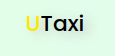
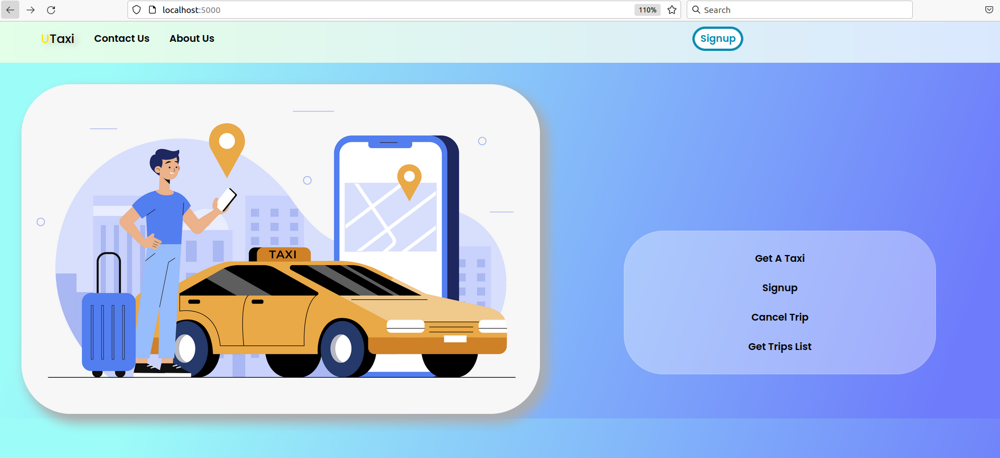

<div align="center">
    <br>
    # Utaxi UT AP
</div>
This is a web based c++ taxi reservation program with users as passengers and drivers.
<br>
The project has been developed based on APHTTP web server that you can find [here](https://github.com/UTAP/APHTTP) in c++ for an assignment in AP course in University of Tehran.
<div align="center">
    
</div>

# Table of Contents
* [Requirements](#requirements)
* [Usage](#usage)
* [Credits](#credits)
* [Contact](#contact)

## Requirements
This project works with c++ 14 or higher versions so make sure to meet the needs. 😄<br>
The project has been included with a ``locations.csv`` file for map locations which you can replace it with your own.
## Usage
1. Clone the repo
 ```sh
   git clone https://github.com/MahdiNoori2003/Utaxi-UT-AP.git
   ```
2. Open terminal in folder and Make the ``.out`` file using make command :
  ```sh
   make
   ```
3. After the ``.out`` file was made run the command below to start the sever :
   
  ```sh
   ./myserver.out locations.csv
   ```
* Note :
  
  ```text
   location.csv is the relative path of the loaction file
   the server runs on http://localhost:5000 but you can change the port in main.cpp
   ```
4. Enjoy 🚖

## Credits
* [Mahdi Noori](https://github.com/MahdiNoori2003)

## contact
* [hitking2007@gmail.com]()
